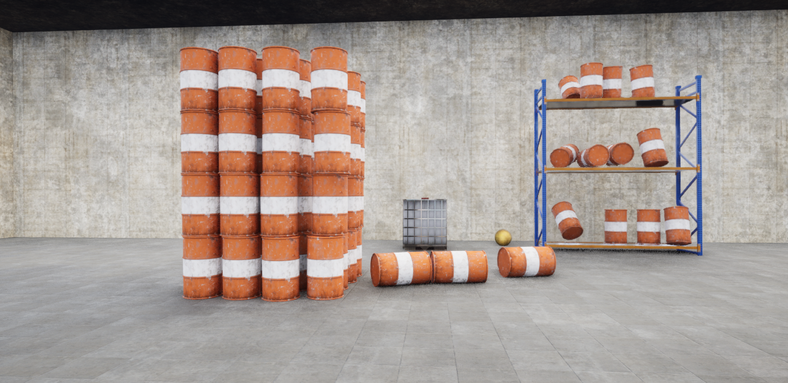

<h1 align="center">CRUD with C#</h1>

A simple example of CRUD using C#

 

     
    
    
    
    
    

 

    <a href="#-about-the-project">About the project</a> •
    <a href="#-license">License</a> •
    <a href="#-contact">Contact</a> 

## 💻 About the project

I did this project with the purpose of practicing and exercising my skills in Unreal Engine. The programming of this project was made only using blueprints. Although the project is simple, it shows how powerful the blueprints can be.
The demo itself it's a free camera shooter that let you wreak havoc at some barrels.
 

 

### Built with
Apart Unreal Engine 5, I used the following tools to build this project.

- [VisualStudio 2022][visualstudio]

## 📃 License

Distributed under the MIT License. See [LICENSE](./LICENSE) for more information.

## 🌟 Contact

Hey :D

If you wanna get in touch, fell free to contact me at:

[LinkedIn][linkedin]

---

Made by Venicio Augusto 

<!-- LINKS-->

[visualstudio]: https://visualstudio.microsoft.com/vs/
[mysql]: https://www.mysql.com/

[linkedin]: https://www.linkedin.com/in/venicio-augusto/